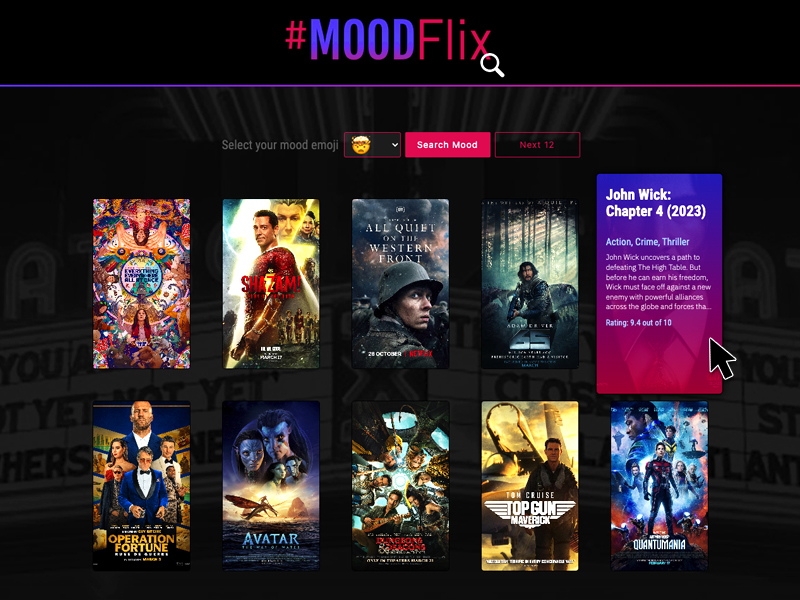

# MoodFlix App
## A Movie For Every Mood!

## Purpose:
Ever wonder what it would be like to choose a movie depending on what type of mood you're in? Well, MoodFlix can help! Simply select a "MoodMoji" from the dropdown menu to search movies that fit your mood. Once your MoodFlix upload to the page, you can hover over the images to reveal the movie title, genre, short description and rating. MoodFlix, let us help you get in the mood.

 

## Website Link:
## https://dronetdevdesign.github.io/Mood-Flix/

 

     

 

## Viewable Responsive Screen Sizes:
* Desktop: 2000px
* Media Query Sizes:
  - 1200px to 992px (Desktop - laptops)
  - 768px (Laptop - tablets)
  - 576px (Small devices)
  - 430px (large cell phones)
  - 490px (small cell phones)

## This Website Created Using:
* HTML 
* CSS
* JavaScript 
* (1) Server-side API’s:
  - API’s used for this project: iMDB api
* Materialize CSS 
* GoogleFonts 
* Git / GitHub

## Graphic Software Used:
* Adobe Photoshop
* Adobe Illustrator

## Contribution:
Bethany Duchene-Jennings, Mykaela Saenz and Ron Dronet
